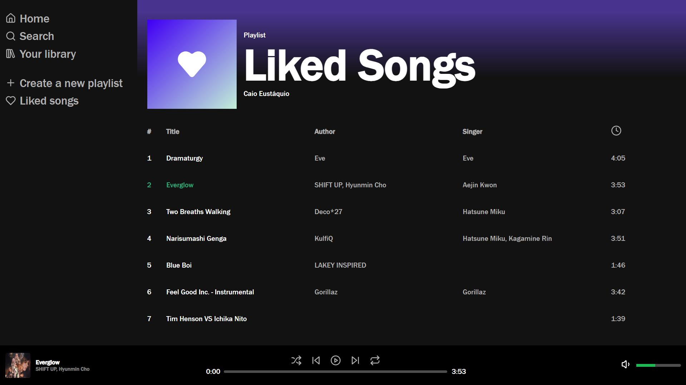

<h1>Music player</h1>

**Um player simples de músicas inspirado no spotify**

    <picture>
        <source media="(prefers-color-scheme: dark)" srcset=".github/screenshots/MusicPlayerIdle.png">
        
    </picture>

[Demonstração](https://caioeustaquio.github.io/music-player/)

## Music Player

Music Player é um simples player de música inspirado no design do Spotify e que reúne as principais funcionalidades do mesmo junto a uma interface moderna e amigável.

### Funcionalidades chave

-   **Interface amigável e flexível:** O player oferece uma interface simples e intuitiva aos usuários.
-   **Todas as opções disponíveis:** Reproduza, pause, avance, volte e outras opções quando desejar.